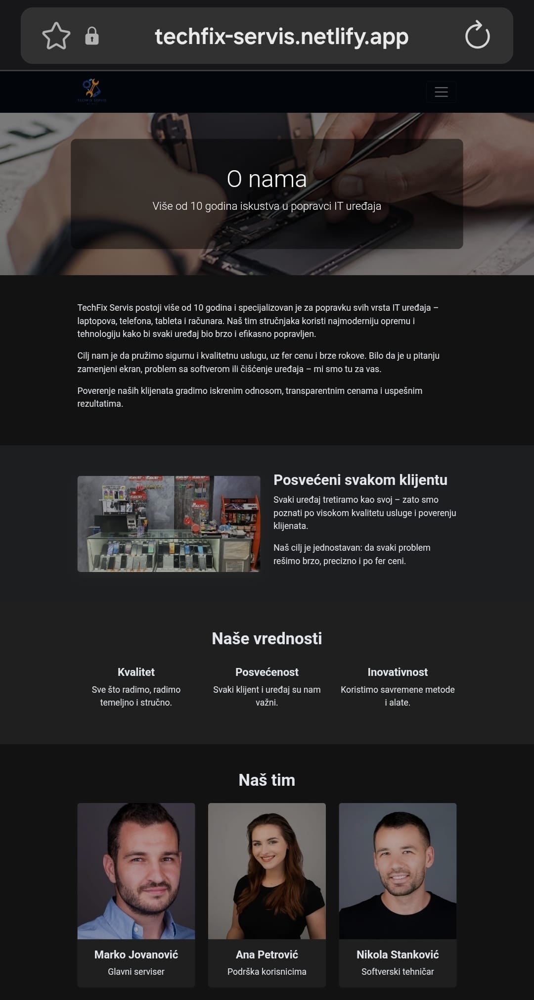

# 🔧 Device Repair Service Website

[](https://techfix-servis.netlify.app/)

> A modern, fully responsive website for IT repair services built with HTML, CSS, Bootstrap, and JavaScript.

## ✨ Features

- 📱 **Fully Responsive Design** - Works seamlessly on all devices
- 🎨 **Modern UI/UX** - Clean and professional interface
- 📝 **Contact Forms** - Interactive forms with validation
- ⚡ **Fast Performance** - Optimized for speed
- 🎯 **Service Showcase** - Clear presentation of services and pricing

## 🛠️ Built With

- **HTML5** - Structure
- **CSS3** - Styling and animations
- **Bootstrap 5** - Responsive framework
- **JavaScript** - Interactivity and validation
- **Netlify** - Deployment

## 🎯 Key Learnings

- Implemented mobile-first responsive design principles
- Mastered Bootstrap grid system and components
- Form validation with vanilla JavaScript
- CSS animations and smooth scrolling
- Cross-browser compatibility

## 📂 Project Structure
```
device-repair-website/
├── index.html
├── akcije.html
├── blog.html
├── download.html
├── faq.html
├── galerija.html
├── kontakt.html
├── mapa.html
├── onama.html
├── recenzije.html
├── usluge.html
├── zastampu.html
├── css/
│ └── style.css
├── js/
│ └── script.js
├── slike/
├── pdf/
│ |── brosura.pdf
│ ├── cenovnik.pdf
│ └── upustvo.pdf
└── README.md
```

## 🔗 Live Demo

Check out the live version: [Device Repair Website](https://techfix-servis.netlify.app/)

## 📬 Contact

**Jovan Planić**

- Email: planicjovan7@gmail.com
- LinkedIn: [Your Profile](https://www.linkedin.com/in/jovan-planic-a31138397/)
- GitHub: [@TVOJ_USERNAME](https://github.com/Planic04)

---

## 📸 Preview

**Desktop Preview**  
  

**Mobile Preview**  
  


⭐ If you like this project, please give it a star on GitHub!